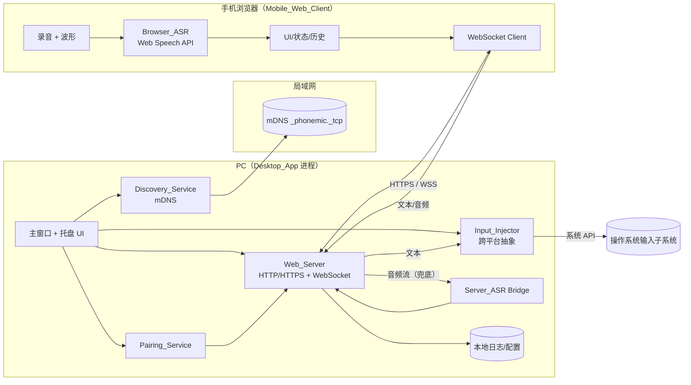
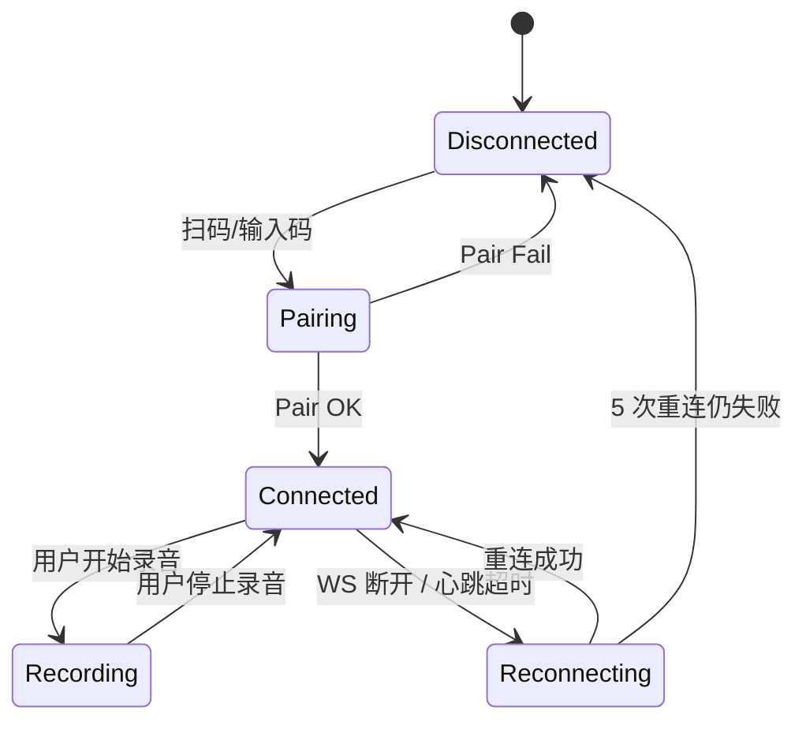
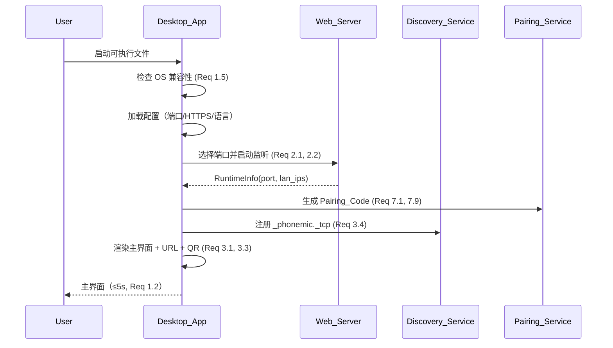
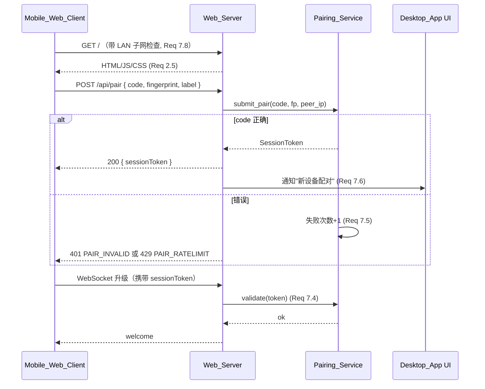
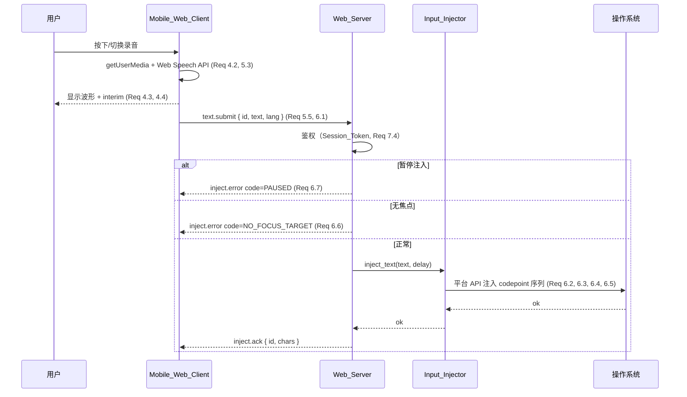
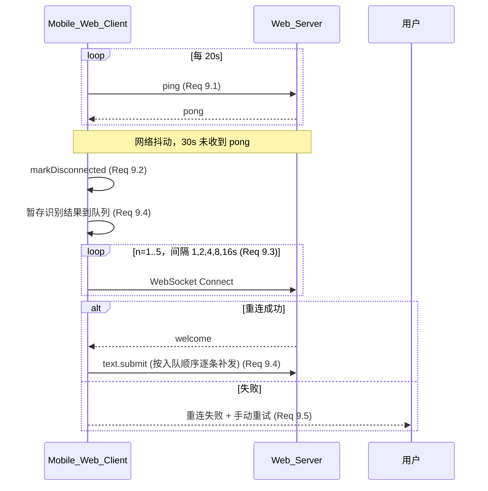
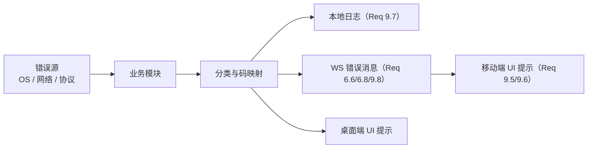

# Design Document

## 1. 概述（Overview）

PhoneMic 将用户的智能手机变成电脑的"无线语音麦克风"。系统由四个逻辑层组成：

1. **Desktop_App（桌面端主进程）**：跨平台桌面应用，承载 Web_Server、托盘 UI、Pairing_Service、Discovery_Service 与 Input_Injector，是整个系统的主控端。
2. **Web_Server（内置 HTTP/HTTPS 服务器）**：在 Desktop_App 内随启动而起，向手机端浏览器分发静态网页资源并提供 WebSocket 端点。
3. **Mobile_Web_Client（手机浏览器网页）**：以纯 Web 技术构建，调用浏览器的 `getUserMedia` 与 `Web Speech API` 完成录音与本地 ASR，把识别后的文本通过 WebSocket 发送到 Desktop_App。
4. **传输与发现层**：包括 mDNS 局域网发现（`_phonemic._tcp`）、二维码连接信息编码以及基于 Pairing_Code/Session_Token 的会话安全机制。

整体设计原则：

- **零安装移动端**：手机不需要安装任何应用，扫码即用，符合 Requirement 2、Requirement 4。
- **就近识别优先**：默认使用浏览器原生 ASR（Browser_ASR），降低服务端压力，同时提供 Server_ASR 兜底（Requirement 5.3、5.4）。
- **明确的安全边界**：仅服务于同一 LAN 子网内，且任何业务请求都必须携带 Session_Token（Requirement 7）。
- **跨平台一致性**：在 Windows / macOS / Linux 上提供等价能力，但允许平台特有的权限申请与托盘行为差异（Requirement 1）。

## 2. 整体架构（Architecture）

### 2.1 架构总览



### 2.2 进程与线程模型

- Desktop_App 单进程多线程：UI 主线程负责窗口/托盘渲染；Web_Server 与 WebSocket 在独立的异步运行时（如 tokio）中处理 I/O；Input_Injector 在专用线程中串行注入，避免 UI 主线程被阻塞。
- 仅一个 Web_Server 实例对应整台机器；多窗口/多托盘项不会创建第二个监听端口。
- Mobile_Web_Client 是单页应用（SPA），所有状态保留在内存与 `localStorage`，刷新页面即重置。

### 2.3 与操作系统的交互边界

- Desktop_App 是唯一持有"模拟键盘"权限的实体；网页不可能、也不被允许直接操控键盘。
- Web_Server 仅监听 LAN 上可路由的 IPv4 地址（不绑定公网接口），子网过滤在请求入口实施（Requirement 7.8）。

## 3. 技术栈选型与理由

下表对每个关键技术决策进行评估并给出推荐项。

### 3.1 跨平台桌面框架：**Tauri（推荐）**

| 维度 | Tauri 2.x | Electron |
|------|-----------|----------|
| 安装包体积 | 5–15 MB | 80–150 MB |
| 内存占用 | 30–80 MB | 200–500 MB |
| 后端语言 | Rust（性能、内存安全） | Node.js |
| 系统 API 访问 | 原生 + 插件 | Node 原生模块或 FFI |
| 系统托盘 | 内置支持 | 内置支持 |
| 启动速度 | 快（满足 Requirement 1.2 的 5 秒） | 较慢 |
| 风险 | 生态比 Electron 小 | 资源占用大、安全攻击面广 |

**推荐 Tauri 2.x**：核心理由为体积、启动时间、资源占用和原生集成度均优于 Electron，与 Requirement 1.2（5 秒内初始化）和后台常驻（Requirement 1.6）契合。前端层 WebView 自动复用系统 WebView2/WKWebView/WebKitGTK，与桌面平台风格一致。

### 3.2 后端语言：**Rust**

- 与 Tauri 原生集成，避免双运行时。
- 高性能异步 I/O，配合 `tokio + axum + tokio-tungstenite`，单机轻松支持心跳/重连密集场景（Requirement 9.1–9.3）。
- 跨平台输入注入存在成熟绑定（`enigo`、`rdev`），Windows/macOS/Linux 一致 API。
- 备选：若团队不熟悉 Rust，可在 Tauri 命令层使用 Rust，业务层仍以 Node.js 实现并通过 IPC，但综合考虑维护成本，仍推荐纯 Rust。

### 3.3 Web Server 与 WebSocket：**axum + tokio-tungstenite**

- `axum`（基于 `hyper`）支持中间件链，便于实现"子网过滤 → 限流 → 鉴权"管道。
- `tokio-tungstenite` 与 axum 共享 `tokio` 运行时，避免线程切换开销。
- TLS 使用 `rustls`（无 OpenSSL 依赖，跨平台分发更简单）。

### 3.4 前端框架（手机端 Web）：**Vue 3 + Vite + UnoCSS**

- 与 React 相比，Vue 3 SFC 单文件包体更小（~50 KB gzip）、首屏更快，符合 Requirement 2.5（2 秒返回页面）。
- Vite 提供极速开发与生产构建，输出可直接打包入 Tauri 资源目录。
- UnoCSS 原子样式，避免运行期 CSS 解析开销。
- 备选：Svelte 体积更小，但团队学习成本与生态对接（如音频可视化库）需评估。

### 3.5 输入注入库：**enigo（统一抽象） + 平台直接调用作为兜底**

- Windows：底层使用 `SendInput`（带 `KEYEVENTF_UNICODE` 标志直接传 Unicode 码点，规避 IME 问题）。
- macOS：使用 `CGEventCreateKeyboardEvent` + `CGEventKeyboardSetUnicodeString`，需要"辅助功能"权限（Requirement 6.8）。
- Linux：优先使用 `uinput`（需 `/dev/uinput` 权限，X11 与 Wayland 都可工作）；`xdotool` 作为 X11 兜底。
- `enigo` 已封装上述大部分能力；针对 Unicode 输入与回车注入的边界（Requirement 6.3、6.4），在 Input_Injector 适配层添加平台特定补丁。

### 3.6 mDNS 实现：**mdns-sd（Rust）**

- 纯 Rust 实现，跨平台行为一致（macOS Bonjour、Windows mDNS、Linux Avahi 都不依赖系统服务）。
- 注册 `_phonemic._tcp.local.` 服务（Requirement 3.4），TXT 记录中携带版本号与是否启用 HTTPS 的标识。

### 3.7 二维码：**qrcode（Rust）→ SVG**

- 在 Desktop_App 内直接生成 SVG，前端 UI 直接嵌入，避免外部网络依赖。

### 3.8 Server_ASR 引擎（兜底）：**whisper.cpp（本地）+ 云端 ASR 适配层**

- 默认本地 `whisper.cpp` 的 small/base 模型，CPU 即可运行，不要求联网。
- 抽象 `ServerASRProvider` trait，未来可接入云端 ASR（如 Azure / 阿里 / 腾讯）。

> 以上推荐均与 Requirement 1（跨平台）、Requirement 2（Web Server）、Requirement 5（ASR）、Requirement 6（输入注入）、Requirement 7（安全）形成直接映射。最终选型可在实现初期通过 PoC 复核。


## 4. 模块设计（Components and Interfaces）

### 4.1 Desktop_App 主进程

职责：
- 启动/关闭整体应用（Requirement 1.2、1.5、2.7）。
- 持有 UI 主窗口与系统托盘（Requirement 1.6）。
- 初始化各子服务并维护其生命周期。
- 暴露设置面板（端口、HTTPS 开关、注入延迟、暂停注入、语言等）。

主要接口（Rust trait 草案）：

```rust
trait AppController {
    fn start(&self) -> Result<RuntimeInfo, StartupError>;
    fn shutdown(&self) -> Result<(), ShutdownError>;
    fn rotate_pairing_code(&self) -> PairingCode;
    fn list_paired_devices(&self) -> Vec<PairedDevice>;
    fn revoke_device(&self, device_id: &str) -> Result<(), RevokeError>;
    fn set_inject_paused(&self, paused: bool);
    fn set_inject_delay_ms(&self, ms: u16);
}
```

`RuntimeInfo` 含：监听端口、是否启用 HTTPS、当前 LAN IP 列表、Pairing_Code。

### 4.2 Web_Server

职责：
- 提供 `/`、`/assets/*`：手机端静态资源。
- 提供 `/api/pair`：POST 提交 Pairing_Code，返回 Session_Token（Requirement 7.2、7.3）。
- 提供 `/api/health`：健康检查与版本号。
- 提供 `/ws`：WebSocket 端点，握手时校验 Session_Token（query 参数或 `Sec-WebSocket-Protocol`）。
- 中间件链：`SubnetFilter → RateLimit → Auth(可选) → Handler`（Requirement 7.8）。

中间件设计：

| 中间件 | 作用 | 关联需求 |
|--------|------|----------|
| SubnetFilter | 拒绝非 LAN 子网请求，直接返回 403 | 7.8 |
| RateLimit | 对 `/api/pair` 按客户端 IP 限制，5 次失败后冻结 5 分钟 | 7.5 |
| Auth | 校验 Session_Token；对 `/`、`/assets/*`、`/api/pair`、`/api/health` 跳过 | 7.4 |

### 4.3 Pairing_Service

职责：生成 Pairing_Code、签发/吊销 Session_Token、管理已配对设备。

核心数据结构：

```rust
struct PairingService {
    current_code: PairingCode,        // 重启失效（Req 7.9）
    failed_attempts: HashMap<IpAddr, FailureWindow>,  // Req 7.5
    sessions: HashMap<SessionToken, Session>,         // 内存 + 持久化
}

struct Session {
    token: SessionToken,
    device_id: String,         // 设备指纹（Req 7.3）
    device_label: String,      // 用户可读名（手机型号 + UA 摘要）
    paired_at: DateTime,
    last_seen: DateTime,
}
```

- Pairing_Code：长度 8，字符集 `[A-Z0-9]`（去除易混字符 0/O/1/I/L），熵约 36^8 ≈ 2.8×10^12（Requirement 7.1）。
- Session_Token：256 位随机数，Base64URL 编码。
- 设备指纹：`SHA-256(UA + screen + 客户端首次连接时间)`，前 16 字节。

接口：

```rust
trait Pairing {
    fn current_pairing_code(&self) -> PairingCode;
    fn submit_pair(&self, code: &str, fp: DeviceFingerprint, peer_ip: IpAddr)
        -> Result<SessionToken, PairError>;
    fn validate(&self, token: &SessionToken) -> Result<Session, AuthError>;
    fn revoke(&self, token: &SessionToken);
    fn revoke_device(&self, device_id: &str);
}
```

### 4.4 Discovery_Service

- 启动时注册 `_phonemic._tcp.local.`，TXT：`v=1`、`tls=1|0`、`port=<port>`。
- 监听 LAN 接口变化（Rust 侧 `if-watch`），变化时重发布并触发主界面 URL/QR 刷新（Requirement 3.5）。
- 当所有 LAN 接口丢失时，向 UI 发出 `LanLost` 事件（Requirement 3.6）。

### 4.5 Input_Injector

跨平台抽象：

```rust
trait InputInjector: Send + Sync {
    fn inject_text(&self, text: &str, delay_ms: u16) -> Result<(), InjectError>;
}

enum InjectError {
    NoFocusTarget,        // Req 6.6
    PermissionDenied,     // Req 6.8
    Paused,               // Req 6.7
    Backend(String),      // 平台 API 报错
}
```

平台实现：

- `WindowsInjector`：`SendInput(KEYEVENTF_UNICODE)` 逐 codepoint 注入；换行映射为 VK_RETURN。
- `MacInjector`：`CGEventCreateKeyboardEvent` + `CGEventKeyboardSetUnicodeString`；启动时探测辅助功能权限。
- `LinuxInjector`：优先 `uinput`（写虚拟键盘设备）；不可用时回退 `xdotool` 子进程。

特殊处理：
- 文本注入前检查焦点：Windows 用 `GetForegroundWindow`，macOS 用 `kAXFocusedUIElementAttribute`，Linux 用 X11 `XGetInputFocus` / Wayland 不可枚举时回退"假定有焦点 + 失败回报"策略。
- 暂停注入时直接返回 `InjectError::Paused`（Requirement 6.7）。

### 4.6 ASR Bridge（Server_ASR）

- 接收 Mobile_Web_Client 通过 WebSocket 推送的 16 kHz PCM/Opus 音频包。
- 维护 `ServerASRProvider` 实例（默认 whisper.cpp，封装为线程安全工作池）。
- 一段静音超过 800ms 视作分段结束，触发识别并返回 `transcript.final` 消息。
- 仅在 Browser_ASR 不可用或用户显式启用时激活（Requirement 5.4）。

### 4.7 Mobile_Web_Client

主要视图：
- `OnboardingView`：当未携带或失效 Session_Token 时引导扫码 / 输入 Pairing_Code。
- `MainView`：录音按钮（按住/切换两种模式，Req 4.2）、波形（Req 4.3）、转写预览（Req 4.4）、识别历史（最近 50 条，Req 4.9）、设置面板。
- `ErrorView`：权限拒绝、识别超时、重连失败等。

主要状态机：



### 4.8 模块间调用矩阵

| 调用方 → 被调用方 | Web_Server | Pairing_Service | Input_Injector | Discovery_Service | Server_ASR |
|-------------------|------------|-----------------|----------------|-------------------|-----------|
| AppController | start/stop | rotate/list/revoke | pause/delay 设定 | start/stop | enable/disable |
| Web_Server (Pair handler) | – | submit_pair | – | – | – |
| Web_Server (WS handler) | – | validate | inject_text | – | feed_audio |
| Discovery_Service | RuntimeInfo 读取 | – | – | – | – |

## 5. 数据模型（Data Models）

### 5.1 WebSocket 消息协议

所有消息为 UTF-8 JSON，结构 `{ "type": <string>, "id"?: <string>, "payload": <object> }`。`id` 用于客户端补发去重（Requirement 9.4）。

#### 5.1.1 客户端 → 服务端

| `type` | 说明 | `payload` 关键字段 | 关联需求 |
|--------|------|--------------------|----------|
| `hello` | WS 建立后首条；用于报告设备指纹与能力 | `deviceLabel`, `lang`, `useServerASR` | 7.3、5.4 |
| `text.submit` | 提交一段最终识别文本进行注入 | `text`, `lang`, `clientTs` | 5.5、6.1 |
| `text.preview` | 中间识别结果（可选，仅做 UI 同步） | `text`, `interim:true` | 4.4 |
| `audio.chunk` | Server_ASR 模式音频包 | `seq`, `codec`, `data(base64)` | 5.4 |
| `audio.end` | Server_ASR 模式分段结束 | `seq` | 5.4 |
| `ping` | 心跳 | `clientTs` | 9.1 |

#### 5.1.2 服务端 → 客户端

| `type` | 说明 | `payload` 关键字段 | 关联需求 |
|--------|------|--------------------|----------|
| `welcome` | 接受连接，返回会话信息 | `serverTs`, `protocol`, `feature.serverASR` | 7.3 |
| `inject.ack` | 注入完成 | `id`, `chars` | 6.1 |
| `inject.error` | 注入失败 | `id`, `code`, `message` | 6.6、6.8、9.8 |
| `transcript.final` | Server_ASR 返回的最终识别结果 | `text`, `lang` | 5.5 |
| `pong` | 心跳应答 | `serverTs` | 9.1 |
| `error` | 通用错误 | `code`, `message` | 9.6 |

### 5.2 HTTP API

`POST /api/pair`

```json
请求:  { "pairingCode": "ABCD2345", "fingerprint": "<hex>", "deviceLabel": "iPhone 15" }
响应:  { "sessionToken": "<base64url>", "expiresAt": "2025-01-01T12:00:00Z" }
错误:  HTTP 401 { "code": "PAIR_INVALID" } | 429 { "code": "PAIR_RATELIMIT", "retryAfter": 300 }
```

`GET /api/health` → `{ "version": "x.y.z", "uptime": <sec> }`（不要求鉴权，仅暴露在子网内）。

### 5.3 配置文件（位于用户配置目录）

```toml
# config.toml
[server]
preferred_port = 18080
enable_https   = false
bind_lan_only  = true        # 默认仅监听 LAN 接口

[ui]
language       = "auto"      # auto | zh-CN | en-US

[asr]
default_lang   = "zh-CN"
prefer_server_asr = false

[input]
inject_delay_ms = 0          # 0–500（Requirement 6.5）
paused = false

[security]
auto_revoke_idle_days = 30
```

### 5.4 已配对设备记录（持久化为 JSON / SQLite）

```json
{
  "deviceId": "9f1a...d2",
  "label":    "Pixel 8 (Chrome)",
  "fingerprint": "9f1a...d2",
  "pairedAt": "2025-01-01T11:50:00+08:00",
  "lastSeen": "2025-01-02T09:00:00+08:00",
  "sessionToken": "<encrypted>"
}
```

> Session_Token 在落盘时使用操作系统密钥库加密（Windows DPAPI / macOS Keychain / Linux Secret Service），未授权进程无法读取。

### 5.5 日志条目

```text
[2025-01-01T12:00:00.123Z][INFO ][web]    Server listening on 192.168.1.5:18080 (https=false)
[2025-01-01T12:00:01.456Z][INFO ][pair]   Device paired: deviceId=9f1a...d2 label="Pixel 8" ip=192.168.1.20
[2025-01-01T12:00:05.789Z][WARN ][inject] InjectFailed code=NO_FOCUS_TARGET text_len=12
```

- 单条 ≤ 4 KB；总量 ≤ 10 MB；按时间滚动覆盖（Requirement 9.7）。
- 日志中不打印 Pairing_Code、Session_Token 与文本明文，仅记录长度与摘要。


## 6. 关键流程（Sequence & State Diagrams）

### 6.1 启动流程



### 6.2 设备配对流程



### 6.3 语音输入到键盘注入端到端流程



### 6.4 重连与消息补发流程




## 7. Correctness Properties

> *Property（属性）是对系统所有合法执行都应当成立的特征或行为，是把人类可读规格连接到机器可验证正确性保证的桥梁。*

本节列出对 PhoneMic 进行属性化测试时应覆盖的属性集合。每条属性以"对所有 / 对任意"为前缀的全称量化形式给出，并标注其所验证的需求条目。属性的具体测试实现将在 tasks 阶段细化。

### Property 1: 端口选择不变量

*For any* 偏好端口 `preferred ∈ [1024, 65535]` 与已占用端口集合 `occupied ⊆ [1024, 65535]`，端口选择算法 `selectPort(preferred, occupied)` 的返回值 `p` 满足：`p ∈ [1024, 65535]`、`p ∉ occupied`、且 `p ≥ preferred` 或 `occupied` 已覆盖 `[preferred, 65535]` 时回退到 `[1024, preferred)` 中的最小空闲端口。

**Validates: Requirements 2.1, 2.2**

### Property 2: LAN IPv4 列表过滤

*For any* 网卡接口列表（含 IPv4/IPv6、回环、公网、RFC1918 私有、CGNAT），过滤函数返回的列表当且仅当包含每个接口的 RFC1918 IPv4 地址，且无重复。

**Validates: Requirements 3.2**

### Property 3: 连接 URL 渲染一致性

*For any* `(scheme ∈ {http, https}, ip, port)` 三元组列表，URL 渲染函数输出对每个三元组形如 `<scheme>://<ip>:<port>` 的字符串，且每个 IP 与端口都出现在最终展示中。

**Validates: Requirements 3.1**

### Property 4: 二维码内容 round-trip

*For any* `(url, pairingCode)` 组合，`qrEncode(url, pairingCode)` 生成的二维码经过解码后等于原始 `(url, pairingCode)`。

**Validates: Requirements 3.3**

### Property 5: LAN 状态映射

*For any* LAN 接口集合 `S`，主界面状态 `view = render(S)` 满足：`S = ∅` ⇒ `view.scanDisabled` 为真且显示"未检测到局域网连接"；`S ≠ ∅` ⇒ 显示的 IP 列表 `view.ips` 等于 `filterLan(S)`，且对接口集合的最后一次变更最终反映在 `view` 上。

**Validates: Requirements 3.5, 3.6**

### Property 6: 录音状态机不变量

*For any* 录音模式 `mode ∈ {press, toggle}` 与任意有限事件序列 `E`（pointer down/up、tap、blur 等），录音状态机执行 `E` 后的 `isRecording` 字段满足：在 `press` 模式下当且仅当存在未释放的 pointer down；在 `toggle` 模式下等价于已发生 tap 次数为奇数。

**Validates: Requirements 4.2**

### Property 7: 自动发送计数

*For any* 识别事件序列（`interim` 与 `final` 混合）且 `autoSend = true`，自动发送逻辑触发的 `text.submit` 调用次数等于序列中 `final` 事件的数量。

**Validates: Requirements 4.7**

### Property 8: 历史队列上限

*For any* 任意长度的识别记录插入序列 `R`，历史队列长度等于 `min(|R|, 50)`，且队列中的元素按时间顺序保留 `R` 的最后 `min(|R|, 50)` 条。

**Validates: Requirements 4.9**

### Property 9: 连接状态文本映射

*For any* 连接状态枚举值 `s ∈ {Disconnected, Connected, Reconnecting, Disconnected}` 与界面语言 `lang`，状态显示函数返回的字符串等于 `i18n[lang][s]`，且对相同 `(s, lang)` 多次调用返回相同结果。

**Validates: Requirements 4.5**

### Property 10: ASR 引擎决策

*For any* `(supportsBrowserASR ∈ {true, false}, preferServerASR ∈ {true, false})` 组合，ASR 引擎选择函数返回 `Browser_ASR` 当且仅当 `supportsBrowserASR ∧ ¬preferServerASR`，否则返回 `Server_ASR`。

**Validates: Requirements 5.3, 5.4**

### Property 11: 文本协议 Unicode round-trip

*For any* Unicode 字符串 `t`（含中文、emoji、全角标点、控制字符），将 `t` 包装为 `text.submit` 消息并经过 JSON 序列化与反序列化后得到的字段值等于 `t`。

**Validates: Requirements 5.5**

### Property 12: Input_Injector 码点保留

*For any* Unicode 字符串 `t`，Input_Injector 在不暂停且有焦点的前提下产生的事件序列对应的码点序列等于 `t` 的 Unicode 码点序列。

**Validates: Requirements 6.3**

### Property 13: Input_Injector 换行映射

*For any* 包含若干 `\n` 的 Unicode 字符串 `t`，Input_Injector 产生的事件序列在每个 `\n` 出现的位置恰好是一次"回车键"事件，且其余位置仍按 Property 12 的码点保留属性输出。

**Validates: Requirements 6.4**

### Property 14: Input_Injector 注入延迟

*For any* `delay ∈ [0, 500]` 与字符串 `t`，Input_Injector 在事件流上相邻字符事件之间的时间间隔不小于 `delay` 毫秒。

**Validates: Requirements 6.5**

### Property 15: 注入暂停

*For any* 注入事件请求序列 `Q` 与 `paused` 切换序列，处于 `paused = true` 期间产生的实际平台注入事件数量为 0；切换回 `paused = false` 后正常注入。

**Validates: Requirements 6.7**

### Property 16: Pairing_Code 字符集与长度

*For any* Pairing_Code 生成调用 `g = generate()`，`|g| ≥ 6`，`g` 中每个字符属于约定字符集（数字 `0-9` 与去除易混的 `A-Z`），且对一万次连续生成结果，重复率不超过 1/10^6。

**Validates: Requirements 7.1**

### Property 17: Pairing_Code 校验

*For any* 当前 Pairing_Code `current` 与候选 `candidate`，校验函数返回 `accept` 当且仅当 `candidate == current`，且校验函数对所有输入运行时间相等（恒定时间比较，防时序攻击）。

**Validates: Requirements 7.2**

### Property 18: Session_Token 生命周期

*For any* 设备指纹 `fp`，配对成功后的 `token` 满足：`validate(token) → Session{fingerprint = fp}` 持续为真，直至显式 `revoke(token)` 或 `revoke_device(fp)` 之后 `validate(token) → AuthError`。

**Validates: Requirements 7.3, 7.4, 7.7**

### Property 19: 配对限流

*For any* 来自同一 IP 的连续失败配对尝试事件序列与时间戳，当窗口内连续失败次数 ≥ 5，则在该 IP 后续 5 分钟内的 `submit_pair` 调用一律被拒绝并返回 `PAIR_RATELIMIT`，5 分钟后失败计数重置。

**Validates: Requirements 7.5**

### Property 20: 已配对设备列表 CRUD

*For any* `pair / revoke / revoke_device` 操作序列，最终设备列表等于"按时间顺序应用各操作后剩余设备的集合"，并且不包含被吊销的设备。

**Validates: Requirements 7.6**

### Property 21: 子网过滤

*For any* IPv4 客户端地址 `ip`，Web_Server 入站中间件对 `ip ∉ LAN` 的请求一律以 HTTP 403 拒绝，且后续中间件与处理器（Pair / WS / API）均不被调用；对 `ip ∈ LAN` 的请求继续执行后续链路。

**Validates: Requirements 7.8**

### Property 22: 重启后 Pairing_Code 失效

*For any* Desktop_App 的"重启"事件，重启前的 `oldCode` 在重启后 `submit_pair(oldCode, …)` 一律返回 `PAIR_INVALID`，且新生成的 `newCode ≠ oldCode`（重复概率 ≤ 1/(36^8)）。

**Validates: Requirements 7.9**

### Property 23: HTTPS 模式下机密信息不通过 HTTP

*For any* `enableHttps = true` 的运行实例，HTTP 端口（如有重定向监听）上的所有响应体与响应头均不包含 Pairing_Code 与任意 Session_Token；这些值仅出现在 HTTPS 通道。

**Validates: Requirements 7.10**

### Property 24: locale → lang 决策

*For any* OS 区域字符串 / `navigator.language` 字符串 `loc`，UI 语言决策函数返回 `zh-CN` 当且仅当 `loc` 主语言子标签为 `zh`，否则返回 `en-US`；同一 `loc` 多次调用返回相同结果。

**Validates: Requirements 8.3, 8.4**

### Property 25: UI 语言切换即时生效

*For any* 任意 UI 切换事件序列与可观测文案集合，每次切换后所有当前可见文案等于目标语言字典中的对应键值，无需刷新页面或重启应用。

**Validates: Requirements 8.5**

### Property 26: UI 语言与 ASR 语言独立

*For any* 由 `setUiLang(l1)` 与 `setAsrLang(l2)` 两类操作构成的事件序列，最终状态满足 `uiLang = 最后一次 setUiLang 的参数`、`asrLang = 最后一次 setAsrLang 的参数`，两者互不影响。

**Validates: Requirements 8.6**

### Property 27: 心跳发送频率

*For any* 时间窗口长度 `T` 秒（连接保持期间），客户端发送的 `ping` 数量满足 `⌊T/20⌋ ≤ count ≤ ⌈T/20⌉ + 1`。

**Validates: Requirements 9.1**

### Property 28: 心跳检测阈值

*For any* 心跳到达事件序列与时间戳 `t_now`，连接状态被标记为 `Disconnected` 当且仅当 `t_now − lastHeartbeat ≥ 30s`。

**Validates: Requirements 9.2**

### Property 29: 重连退避序列

*For any* 一次断开事件触发的连续重连尝试，第 `n` 次（`n ∈ [1, 5]`）尝试与第 `n-1` 次尝试之间的时间间隔等于 `2^(n-1)` 秒（n=1 视为相对断开瞬间），且总尝试次数不超过 5。

**Validates: Requirements 9.3**

### Property 30: 离线消息补发保序

*For any* 在 `Reconnecting` 状态下入队的识别结果序列 `Q`，重连成功后向服务端发送的 `text.submit` 序列与 `Q` 顺序一致，每条恰好补发一次，无丢失或重复。

**Validates: Requirements 9.4**

### Property 31: 错误协议鲁棒性

*For any* 通过 WebSocket 进入服务端的字节序列（合法 / 非法 JSON、缺字段、无 Session_Token），处理过程不抛出未捕获异常；对不合法或缺鉴权的输入，服务端返回结构化错误对象 `{ code, message }` 并丢弃该消息。

**Validates: Requirements 9.6**

### Property 32: 日志滚动

*For any* 任意长度的日志写入序列，单条落盘大小 ≤ 4 KB，磁盘占用 ≤ 10 MB；超出上限时最旧条目被淘汰，且新条目始终能被读取。

**Validates: Requirements 9.7**

### Property 33: 注入失败传播

*For any* Input_Injector 抛出的异常事件 `e`，Desktop_App 必有：本地日志中存在一条对应错误条目，且通过 Connection_Channel 发送了一条 `inject.error` 消息（含错误码与摘要）。

**Validates: Requirements 9.8**

### Property 34: 后台返回触发重连

*For any* `visibilitychange` 事件序列，每次从 `hidden` 变为 `visible` 时，若当前 WebSocket 状态不是 `Connected`，则触发一次重连尝试。

**Validates: Requirements 9.9**


## 8. 错误处理（Error Handling）

### 8.1 错误码体系

PhoneMic 使用统一的、可序列化的错误对象结构，跨 HTTP、WebSocket 与桌面端日志保持一致：

```json
{
  "code":    "INJECT_NO_FOCUS_TARGET",
  "message": "当前操作系统无可识别的输入焦点",
  "detail":  { "platform": "macos" },
  "ts":      "2025-01-01T12:00:00.123Z"
}
```

错误码命名采用大写蛇形，前缀代表所属模块。下表为完整错误码清单及对应需求：

| 错误码 | HTTP 状态 / WS 通道 | 模块 | 触发条件 | 关联需求 |
|--------|---------------------|------|----------|----------|
| `OS_UNSUPPORTED` | 启动期对话框 | App | 当前 OS 或版本不在受支持范围 | 1.5 |
| `PORT_UNAVAILABLE` | 启动期对话框 | Web_Server | 全部候选端口被占用 | 2.8 |
| `LAN_LOST` | UI 横幅 | Discovery | 检测不到任何 LAN 接口 | 3.6 |
| `MIC_PERMISSION_DENIED` | 移动端 UI | Mobile | `getUserMedia` 拒绝 | 4.8 |
| `ASR_TIMEOUT` | 移动端 UI | Mobile | 10s 内 ASR_Engine 无最终结果 | 5.7 |
| `PAIR_INVALID` | HTTP 401 | Pairing | Pairing_Code 不匹配 | 7.2、7.5 |
| `PAIR_RATELIMIT` | HTTP 429 | Pairing | 同一 IP 5 次失败后冻结 5 分钟 | 7.5 |
| `AUTH_REQUIRED` | HTTP 401 / WS close 4401 | Auth | 缺少或无效的 Session_Token | 7.4、9.6 |
| `FORBIDDEN_SUBNET` | HTTP 403 | SubnetFilter | 请求来源不在 LAN 子网内 | 7.8 |
| `INJECT_NO_FOCUS_TARGET` | WS `inject.error` | Input_Injector | 系统无可识别输入焦点 | 6.6、9.8 |
| `INJECT_PERMISSION_DENIED` | WS `inject.error` + UI | Input_Injector | macOS 辅助功能 / Linux uinput 权限缺失 | 6.8、9.8 |
| `INJECT_PAUSED` | WS `inject.error` | Input_Injector | "暂停注入"开关开启 | 6.7 |
| `INJECT_BACKEND_ERROR` | WS `inject.error` | Input_Injector | 平台 API 抛出未知异常 | 9.8 |
| `MSG_BAD_FORMAT` | WS `error` | Web_Server | 收到非法 JSON 或缺字段消息 | 9.6 |
| `RECONNECT_FAILED` | 移动端 UI | Mobile | 5 次重连仍未恢复 | 9.5 |

### 8.2 错误传播路径



设计原则：

- **永不静默**：每个被分类后的错误都至少落入"日志 + 用户可见提示"两条路径之一。
- **不外泄敏感信息**：错误消息中不包含 Pairing_Code、Session_Token 与文本明文，遵循 Requirement 9.7 的日志安全约定。
- **结构化优先**：所有面向客户端的错误都使用上文统一对象结构，便于前端集中处理（满足 Requirement 9.6 的"结构化错误对象"要求）。

### 8.3 重连与降级策略

| 场景 | 策略 | 关联需求 |
|------|------|----------|
| WS 心跳超时 | 标记断开 → 触发重连 | 9.1、9.2 |
| 自动重连 | 5 次上限，间隔 1s/2s/4s/8s/16s（指数退避） | 9.3 |
| 重连期间识别结果 | 暂存到本地 FIFO 队列，重连成功后按序补发 | 9.4 |
| 重连耗尽 | 切换到"重连失败"视图 + 手动重试按钮 | 9.5 |
| 后台返回前台 | `visibilitychange → visible` 时检查 WS 状态，必要时重连 | 9.9 |
| Browser_ASR 不可用 | 自动切换至 Server_ASR，并在 UI 提示已降级 | 5.3、5.4 |
| 注入权限缺失 | 暂停注入 + 弹出权限引导 + 已接收文本继续展示 | 6.7、6.8 |

### 8.4 日志策略

- 实现库：Rust 端使用 `tracing` + 自定义 `RollingFileLayer`；前端使用受限 `console` 包装器，避免在生产环境写入用户文本。
- 单条上限 4 KB（超出截断并附 `…<truncated>` 标记），总量 10 MB 触发滚动覆盖（保留最近若干小时）。
- 默认级别：`info`；可在设置中临时切换至 `debug`，但 `debug` 模式不持久化保存。
- 不写入文本明文与机密：注入文本仅以 `text_len` 与 SHA-256 前 8 字节摘要形式记录。
- 日志条目固定字段：`ts | level | module | event | code | detail`，便于离线诊断时 `grep`。

### 8.5 用户可见提示一览

| 场景 | 桌面端 | 移动端 |
|------|--------|--------|
| OS 不支持 | 模态对话框 + 退出按钮 | 不适用 |
| 端口启动失败 | 错误页 + "重试" 按钮 | 无法访问页面 |
| 无 LAN | 顶部横幅 + 扫码区域置灰 | 不适用（无法连入） |
| 麦克风权限被拒 | 不适用 | 占位视图 + 不同浏览器/系统的指引步骤链接 |
| 鉴权失败 | 通知中心提示 | 跳转 `OnboardingView` 重新配对 |
| 注入失败 | 通知中心提示（含错误码） | 当前消息标记为红色 + 重试按钮 |
| 重连失败 | 不适用 | 错误视图 + 手动重连按钮 |


## 9. 测试策略（Testing Strategy）

PhoneMic 的测试策略由四层组成：**单元测试 → 属性测试 → 集成测试 → 端到端测试**。前两层在 PR 流水线上对所有平台执行；后两层在每日构建与发版前对三平台执行。

### 9.1 测试层级总览

| 层级 | 范围 | 工具建议 | 触发频率 |
|------|------|----------|----------|
| 单元测试 | 纯函数、状态机、组件渲染 | Rust `cargo test`；前端 `vitest` | 每次 PR |
| 属性测试 | 见第 7 节列出的 34 条 Property | Rust `proptest`；前端 `fast-check` | 每次 PR |
| 集成测试 | Web_Server / Pairing / WS 真实组装 | Rust 集成测试 + `tokio-tungstenite` 客户端；前端 `playwright` | 每次 PR（部分仅 nightly） |
| 端到端测试 | Desktop_App ↔ Mobile_Web_Client ↔ OS | Tauri WebDriver + Appium / Playwright Mobile + 真机或云机房 | Nightly + 发版前 |

### 9.2 属性测试规范

- 属性测试库：Rust 侧使用 [proptest](https://github.com/proptest-rs/proptest)；前端侧使用 [fast-check](https://fast-check.dev/)。两者均不允许从零自实现 PBT 框架。
- 每条属性测试至少 100 次迭代（库默认值通常更高）。
- 每个属性测试用例的注释顶部以下列格式标注，便于回溯到设计文档：

  ```rust
  // Feature: phone-mic-voice-input, Property 1: 端口选择不变量
  ```

- 失败用例自动收缩（shrinking）后将被记录到 `proptest-regressions/` 与 `fast-check` regression file，用于后续回归。
- 共享生成器：
  - `unicode_text()`：含中文、emoji、控制字符、超长字符串边界。
  - `lan_iface_set()`：随机生成 IPv4/IPv6、loopback、私有、CGNAT、公网等组合。
  - `pair_event_seq()`：随机生成 pair / validate / revoke 操作序列。
  - `interim_final_seq()`：用于 Property 7、Property 30 的 ASR 事件流。
  - `inject_event_seq()`：用于 Property 12–15 的注入事件流。

### 9.3 单元测试要点

- 启动画面状态切换、错误视图、按钮存在性等 UI 单元测试用 `vitest` + `@testing-library/vue`，输出为快照。
- 端口选择、LAN 过滤、URL 渲染、Pairing_Code 校验、Session 状态机等纯函数与状态机使用 `cargo test`，并由属性测试覆盖广义不变量。
- i18n 字典完整性：单元测试断言中文、英文字典 key 集合相等且无空字符串（覆盖 Requirement 5.1、8.1、8.2）。

### 9.4 集成测试要点

| 用例 | 描述 | 关联需求 |
|------|------|----------|
| 启动→主页可用 | 启动 Web_Server，HTTP `GET /` 与 WS 升级各 1 次 | 2.1、2.5、2.6 |
| 子网过滤 | 模拟伪造 X-Forwarded-For 与公网 IP 客户端，断言 403 | 7.8 |
| 配对鉴权 | 正确码、错误码各若干次，断言 token 与限流 | 7.2、7.3、7.5 |
| HTTPS 模式 | 启用 HTTPS 后断言机密信息不出现在 HTTP 响应中 | 7.10 |
| mDNS 发现 | 启动后由独立 mDNS 客户端 browse `_phonemic._tcp` | 3.4 |
| Whisper.cpp Bridge | 喂入预录音频，验证文本输出（仅 nightly，CPU 较慢） | 5.4、5.5 |

### 9.5 端到端测试要点

- 三平台（Windows / macOS / Linux）冒烟脚本：启动 Desktop_App → 显示 URL/QR → 移动端 Playwright/Appium 完成扫码与配对 → 发送一段中文文本 → 在系统记事本/编辑器中断言文本到达且 Unicode 字符未损坏（覆盖 Requirement 6.1–6.4）。
- 移动浏览器矩阵：iOS Safari 15+、Android Chrome 100+ 至少各一台真机或云机房（覆盖 Requirement 4.1）。
- 性能基线：启动到主窗口的端到端耗时 ≤ 5s（Requirement 1.2）；首页 HTTP 响应 ≤ 2s（Requirement 2.5）；可在 CI 上以 95 分位数为指标。
- 注入权限：macOS 在干净环境下首次启动应触发"辅助功能"申请；用例验证拒绝时进入暂停状态，授权后恢复（Requirement 6.8）。

### 9.6 测试与平台/外部依赖隔离

- Input_Injector 在三平台均提供"虚拟 backend"用于属性测试：将事件写入内存中的 `Vec<InjectEvent>`，便于对码点序列、回车映射、间隔时间做断言（Property 12–15）。生产路径仍直接调用平台 API。
- mDNS、TLS 证书生成、whisper.cpp 等耗时副作用在单元/属性测试中通过 trait 注入 mock 实现替代；仅在集成测试与端到端测试中使用真实实现。
- 时间敏感场景（心跳、退避、限流、日志滚动）在测试中使用 `tokio::time::pause` 与 `vi.useFakeTimers()`，避免真实等待。

### 9.7 覆盖率与门禁

- Rust：`cargo llvm-cov`，行覆盖率门禁 80%，关键模块（Pairing、Web_Server、Input_Injector）≥ 90%。
- 前端：`vitest run --coverage`，行覆盖率 80%。
- PR 必须通过：单元 + 属性 + 集成；端到端在 nightly 与 release 候选构建上跑。


## 10. 需求追溯总表（Requirements Traceability）

下表把所有验收条件映射到本设计文档中的相关章节、组件与属性编号，确保 Requirement 1–9 全覆盖。

| Req | 设计章节 / 组件 | 属性编号 | 测试层级 |
|-----|------------------|----------|----------|
| 1.1 | §3.1 Tauri 选型；§9 启动性能 | – | SMOKE / 集成 |
| 1.2 | §6.1 启动序列图；§9.5 端到端 | – | 集成 |
| 1.3 | §4.1 主进程；§9.3 单元 | – | 单元（快照） |
| 1.4 | §3、§9.5 三平台 E2E | – | E2E |
| 1.5 | §4.1 OS 兼容性检查；§8.1 `OS_UNSUPPORTED` | – | 单元 |
| 1.6 | §4.1 主进程；§9.4 平台 UI | – | 集成 |
| 2.1 | §4.2 Web_Server；§6.1 启动序列 | – | 集成 |
| 2.2 | §4.2 Web_Server | Property 1 | PBT |
| 2.3 | §3.3 axum；§4.2 中间件 | – | SMOKE |
| 2.4 | §3.3 rustls；§5.3 配置 | – | 单元 |
| 2.5 | §4.2 静态资源；§9.5 性能 | – | 集成 |
| 2.6 | §4.2 `/ws` 端点 | – | 集成 |
| 2.7 | §4.1 shutdown | – | 单元 |
| 2.8 | §8.1 `PORT_UNAVAILABLE` | – | 单元 |
| 3.1 | §4.1 RuntimeInfo；§4.2 主界面 | Property 3 | PBT |
| 3.2 | §4.4 Discovery；网卡过滤 | Property 2 | PBT |
| 3.3 | §3.7 qrcode；§4.1 主界面 | Property 4 | PBT |
| 3.4 | §3.6 mdns-sd；§4.4 Discovery | – | 集成 |
| 3.5 | §4.4 Discovery 接口变化 | Property 5 | PBT |
| 3.6 | §4.4 LanLost；§8.5 提示 | Property 5 | PBT |
| 4.1 | §3.4 Vue 3；§9.5 浏览器矩阵 | – | E2E |
| 4.2 | §4.7 录音状态机 | Property 6 | PBT |
| 4.3 | §4.7 MainView | – | 单元（快照） |
| 4.4 | §4.7 实时预览；§5.1 `text.preview` | – | 单元 |
| 4.5 | §4.7 状态显示 | Property 9 | PBT |
| 4.6 | §4.7 MainView | – | 单元 |
| 4.7 | §4.7 自动发送；§5.1 `text.submit` | Property 7 | PBT |
| 4.8 | §8.1 `MIC_PERMISSION_DENIED` | – | 单元 |
| 4.9 | §4.7 历史队列 | Property 8 | PBT |
| 5.1 | §4.6 ASR Bridge；§9.3 i18n 字典 | – | 单元 |
| 5.2 | §4.7 设置面板 | – | 单元 |
| 5.3 | §4.6 ASR 决策 | Property 10 | PBT |
| 5.4 | §4.6 Server_ASR；§5.1 `audio.chunk` | Property 10 | PBT + 集成 |
| 5.5 | §5.1 协议；UTF-8 round-trip | Property 11 | PBT |
| 5.6 | §3.8 whisper.cpp；§9.5 性能 | – | 集成 |
| 5.7 | §8.1 `ASR_TIMEOUT` | – | 单元 |
| 5.8 | §4.7 编辑入口 | – | 单元 |
| 6.1 | §4.5 Input_Injector；§6.3 流程 | – | E2E |
| 6.2 | §3.5 平台库选型 | – | SMOKE |
| 6.3 | §4.5 Input_Injector | Property 12 | PBT |
| 6.4 | §4.5 Input_Injector | Property 13 | PBT |
| 6.5 | §4.5 注入延迟 | Property 14 | PBT |
| 6.6 | §8.1 `INJECT_NO_FOCUS_TARGET` | – | 单元 |
| 6.7 | §4.5 暂停注入 | Property 15 | PBT |
| 6.8 | §8.1 `INJECT_PERMISSION_DENIED` | – | 集成 |
| 7.1 | §4.3 Pairing_Service；Pairing_Code 字符集 | Property 16 | PBT |
| 7.2 | §4.3 submit_pair；恒定时间比较 | Property 17 | PBT |
| 7.3 | §4.3 Session 颁发 | Property 18 | PBT |
| 7.4 | §4.2 Auth 中间件；§4.3 validate | Property 18 | PBT |
| 7.5 | §4.3 失败计数器 | Property 19 | PBT |
| 7.6 | §4.1 设备列表；§4.3 revoke_device | Property 20 | PBT |
| 7.7 | §4.3 revoke + WS 关闭 | Property 18 | PBT |
| 7.8 | §4.2 SubnetFilter | Property 21 | PBT |
| 7.9 | §4.3 重启失效 | Property 22 | PBT |
| 7.10 | §3.3 rustls；§4.2 HTTPS only token | Property 23 | PBT |
| 8.1 | §4.1 i18n；§9.3 单元 | – | 单元 |
| 8.2 | §4.7 i18n | – | 单元 |
| 8.3 | §4.1 默认语言 | Property 24 | PBT |
| 8.4 | §4.7 navigator.language | Property 24 | PBT |
| 8.5 | §4.1 / §4.7 切换入口 | Property 25 | PBT |
| 8.6 | §4.7 ASR vs UI 语言独立 | Property 26 | PBT |
| 9.1 | §4.7 心跳；§5.1 `ping/pong` | Property 27 | PBT |
| 9.2 | §4.7 心跳超时 | Property 28 | PBT |
| 9.3 | §4.7 重连退避 | Property 29 | PBT |
| 9.4 | §4.7 离线队列；§6.4 流程 | Property 30 | PBT |
| 9.5 | §8.1 `RECONNECT_FAILED`；§8.5 UI | – | 单元 |
| 9.6 | §4.2 / §8.1 `MSG_BAD_FORMAT` `AUTH_REQUIRED` | Property 31 | PBT |
| 9.7 | §8.4 日志策略 | Property 32 | PBT |
| 9.8 | §8.1 inject 错误家族；§4.5 | Property 33 | PBT |
| 9.9 | §4.7 visibilitychange 处理 | Property 34 | PBT |

> 表中"–"表示该需求不适合或不需要属性测试，已在对应单元 / 集成 / E2E 层做覆盖。
