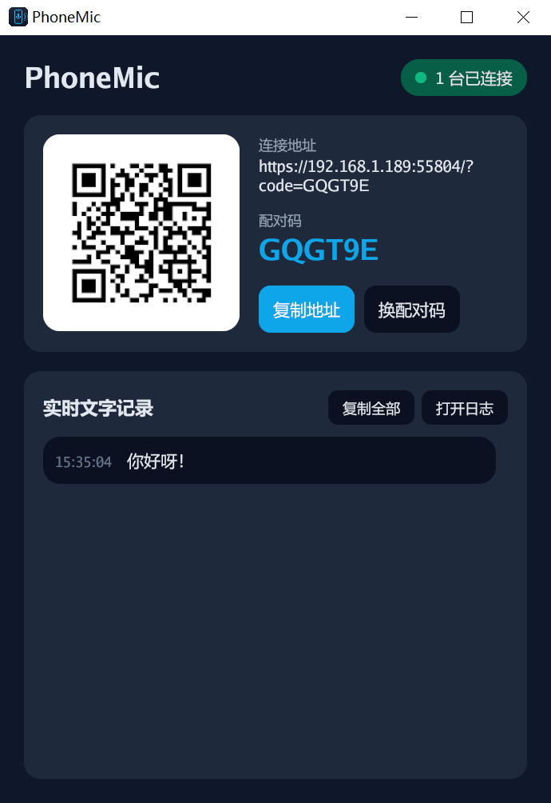
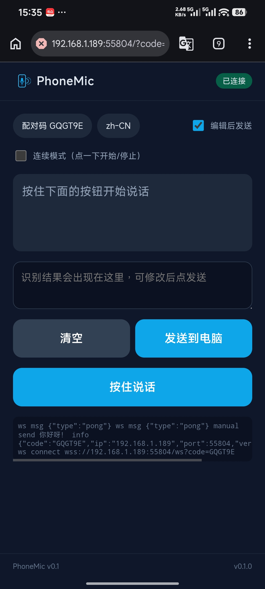

<div align="center">


# PhoneMic

**Turn your phone into a wireless microphone that types on your computer.**

**English** · [简体中文](README.zh-CN.md)

</div>

Speak into your phone → the browser's built-in Web Speech API transcribes it →
the text is pushed to your desktop over WebSocket → the desktop pastes it into
whatever window currently has focus.

- **Single binary** — no installer, no runtime, no frontend build chain.
- **Phone needs nothing** — just open a URL in the browser. No app to install.
- **Desktop GUI window** — embedded QR code, live connection status, and a
  running text log, all in one window.
- **Chinese & English** (and any language the Web Speech API supports).

---

## Screenshots

| Desktop window | Phone web page |
|:---:|:---:|
|  |  |
| QR code · connection status · pair code · recent-text log | Hold-to-talk · edit-before-send · Enter key · send history |

---

## How it works

```
[ Phone browser ]
    │  hold to record → MediaStream
    │  Web Speech API recognizes → final text
    ▼
[ WebSocket  /ws?code=XXXXXX ]   ← pair-code check
    │
[ Desktop (Go + gioui) ]
    │  write to clipboard   (atotto/clipboard)
    │  press Ctrl+V / Cmd+V (micmonay/keybd_event)
    │  (can also press a single Enter → send / newline / confirm)
    ▼
[ The input field that currently has focus ]
```

The desktop and phone talk over **HTTPS + WebSocket** on your local Wi-Fi.
HTTPS is mandatory because the Web Speech API only runs in a *secure context*.

---

## Quick start (run from source)

You need **Go 1.25+**. No CGO toolchain is required on Windows (gioui's Windows
backend is pure Go).

```bash
# 0) Confirm your Go version is >= 1.25
go version
# expected output like: go version go1.25.x windows/amd64

# 1) Clone the repo
git clone https://github.com/AnotherJ1/PhoneMic.git

# 2) Enter the desktop program dir (the main package lives in cmd/phonemic,
#    NOT the repo root)
cd PhoneMic/cmd/phonemic

# 3) Fetch & verify dependencies (first run downloads gioui etc. — needs network)
go mod tidy

# 4) Run directly (compiles and immediately launches the GUI window)
go run .
```

> **Windows note**: `go run .` keeps a console window around (handy for logs).
> To get rid of it, build with the `-H windowsgui` flag shown under "Building a
> release binary" below and run that binary instead.
>
> **Linux first run**: key injection needs uinput permission — run
> `sudo usermod -aG input $USER` and re-login first, otherwise injection fails
> (see "Known limitations").

A **PhoneMic window** opens (centered on screen). It shows:

| Element | What it does |
|---|---|
| **QR code** | Scan it with your phone to open the connection page |
| **Connect URL** | `https://192.168.x.x:PORT/?code=ABCXYZ` — click **Copy URL** to copy |
| **Pair code** | 6 chars — click **Rotate** to regenerate (kicks all current phones) |
| **Status pill** | Top-right; turns green and shows the count when phones connect |
| **Recent text** | The latest injected texts with timestamps (newest first, max 50) |

On your phone (same Wi-Fi):

1. Scan the QR code, or open the copied URL.
2. The browser warns the connection is "not secure" — this is expected for a
   self-signed local certificate. Tap **Advanced → Proceed**.
3. Hold **Hold to talk** and speak. By default **Edit before send** is on, so
   the transcript lands in an editable box first; review it, then tap **Send**.
4. The text appears at your computer's cursor.
5. Tap **↵ Enter** to make the computer press a single Enter key (newline / send
   a chat message / confirm a dialog).
6. Everything you send is listed under **Send history** (stored locally on the
   phone, survives refresh/reconnect); tap **Resend** on any entry to drop it
   back into the edit box, tweak it, and send again.

> Closing the window quits the whole program (the background HTTPS server stops with it).

---

## Building a release binary

The compiled binary is self-contained (web assets, TLS cert logic, and the
window icon are all embedded) and runs on any same-architecture machine by
double-clicking.

### Current platform (uses `build.sh`)

```bash
# Run from the repo root; the script detects your OS and builds into
# cmd/phonemic/dist/
bash cmd/phonemic/build.sh
```

### Windows, by hand

```bash
cd cmd/phonemic
# CGO_ENABLED=0   → pure-Go build, no GCC toolchain needed
# -trimpath       → strip the build machine's absolute paths (cleaner/reproducible)
# -H windowsgui   → no console window at runtime (GUI app)
# -s -w           → strip symbol table & debug info to shrink the binary
# -X main.version → bake the version into the binary (read by /info); defaults to 0.1.0
CGO_ENABLED=0 go build -trimpath -ldflags "-s -w -H windowsgui -X main.version=0.1.0" -o phonemic.exe .
```

Current Windows amd64 release is about **13 MB**.

### macOS, by hand

```bash
cd cmd/phonemic
# macOS gioui backend uses Metal/Cocoa → CGO required (needs Xcode Command Line Tools)
CGO_ENABLED=1 go build -trimpath -ldflags "-s -w -X main.version=0.1.0" -o phonemic .
```

### Linux, by hand

```bash
cd cmd/phonemic
# Linux gioui backend uses Vulkan/X11/Wayland → CGO required, plus dev libraries.
# This set matches CI (.github/workflows/release.yml) on Debian/Ubuntu:
#   sudo apt-get update
#   sudo apt-get install -y gcc pkg-config \
#     libwayland-dev libx11-dev libx11-xcb-dev libxkbcommon-x11-dev \
#     libgles2-mesa-dev libegl1-mesa-dev libffi-dev libxcursor-dev libvulkan-dev
# Official deps: https://gioui.org/doc/install/linux
CGO_ENABLED=1 go build -trimpath -ldflags "-s -w -X main.version=0.1.0" -o phonemic .
```

### Run tests / static checks

```bash
cd cmd/phonemic
go test ./...   # unit tests (font probing, pair code, text-log ring buffer, etc.)
go vet ./...    # static analysis
```

### All platforms at once (GitHub Actions)

> ⚠️ You **cannot** cross-compile every platform from one machine. gioui's
> Windows backend is pure Go (Direct3D), but its macOS (Metal/Cocoa) and Linux
> (Vulkan/X11/Wayland) backends require **CGO and the matching native OS**.

Push a `v*` tag and the CI matrix in
[`.github/workflows/release.yml`](.github/workflows/release.yml) builds all four
targets on their native runners and attaches them to a GitHub Release:

```bash
git tag v0.1.0
git push origin v0.1.0
```

| Target | Runner | CGO |
|---|---|---|
| `windows-amd64` | `windows-latest` | off |
| `linux-amd64` | `ubuntu-latest` (installs gioui deps) | on |
| `darwin-amd64` | `macos-13` (Intel) | on |
| `darwin-arm64` | `macos-14` (Apple Silicon) | on |

---

## Regenerating the logo / icons

The logo source is [`cmd/phonemic/assets/logo.svg`](cmd/phonemic/assets/logo.svg).
To regenerate web favicons and the embedded Windows icon:

```bash
cd cmd/phonemic/assets
npm i sharp                       # one-time, for SVG → PNG
node render.js                    # writes web favicons + ico/*.png
cd winres && go-winres make --in winres.json --out ../../rsrc
# → produces rsrc_windows_*.syso, auto-embedded on the next `go build`
```

gioui loads icon resource ID `1` from the executable, so the `.syso` gives the
window and taskbar the PhoneMic icon automatically.

---

## Phone-side options

| Option | Description |
|---|---|
| **Language pill** | Tap to cycle `zh-CN` / `en-US` |
| **Continuous mode** | Tap-to-start / tap-to-stop instead of hold; auto-restarts after silence |
| **Edit before send** (default on) | Transcript goes to an editable box first; fix it, then **Send** |
| **↵ Enter** | Make the computer press a single Enter key in the focused window (newline / send / confirm) |
| **Send history** | Lists text you've sent from this phone (stored in browser localStorage, max 50, survives refresh/reconnect); has a **Clear** button |
| **Resend** | Tap **Resend** on a history entry to drop it back into the edit box, then send again |
| **Click sound** | Every button tap plays a short "beep" for feedback (synthesized via Web Audio — no audio file downloaded) |

---

## Security model

- Listens on `0.0.0.0:<random port>`; only an RFC1918 private IP
  (192.168 / 10.x / 172.16–31) is shown in the connect URL.
- `/ws` **requires** `?code=XXXXXX`; a mismatch returns HTTP 403.
- The 6-char pair code is `[A-Z2-9]` (no `0/O/1/I`), generated with `crypto/rand`.
- **Rotate** regenerates the code and force-closes every existing connection.
- **Max 8 connections**: extra connections are politely closed to prevent
  resource exhaustion.
- **Dead-connection detection**: the server sends a protocol-level ping every
  30s and drops any connection that goes silent for 60s (so a phone that drops
  off Wi-Fi doesn't leave a zombie connection inflating the count).
- Self-signed HTTPS: the cert's SAN includes the LAN IP, `127.0.0.1`, and
  `localhost`; it is cached and reused. A public CA cannot sign a LAN IP, so the
  browser's "not secure" prompt is unavoidable — proceeding once is safe here.

---

## Known limitations

- **Web Speech API depends on Google's servers on Android Chrome.** It uploads
  audio to Google for recognition, so if the network can't reach Google you get
  `sr error network` and nothing is transcribed. iOS Safari uses Apple's engine
  and is unaffected. Fully offline recognition would mean moving STT to the
  desktop (e.g. whisper.cpp) — a separate effort.
- **iOS Safari needs 14+** for `webkitSpeechRecognition`.
- **Linux key injection needs uinput permission:**
  `sudo usermod -aG input $USER`, then re-login.
- **macOS prompts for Accessibility permission** on the first Cmd+V: allow
  *phonemic* under System Settings → Privacy & Security → Accessibility.
- The clipboard is used as the injection carrier, but the desktop restores your
  original clipboard ~150 ms after pasting.

---

## Protocol reference

WebSocket, client → server:

```json
{ "type": "text", "text": "hello world" }   // write to clipboard & paste into focused window
{ "type": "enter" }                          // press a single Enter key in the focused window
{ "type": "reset" }                          // new recording segment: clear smart-spacing state
{ "type": "ping" }                           // application-level heartbeat (server replies pong)
```

WebSocket, server → client:

```json
{ "type": "pong" }   // reply to the application-level ping
```

> Besides this application-level heartbeat, the server also sends a
> **protocol-level** WebSocket ping (every 30s) for dead-connection detection;
> the browser replies with a protocol-level pong automatically — no frontend code needed.

HTTP:

- `GET /` → static frontend (`index.html`)
- `GET /info` → `{ code, port, ip, version }`
- `GET /ws?code=XXXXXX` → WebSocket upgrade (403 on code mismatch)

---

## Tech stack

Desktop is **pure Go**; on Windows the build needs **no CGO**.

| Dependency | Role |
|---|---|
| `gioui.org` | Desktop GUI window (Direct3D / Metal / Vulkan) |
| `github.com/gorilla/websocket` | WebSocket transport |
| `github.com/atotto/clipboard` | Clipboard read/write |
| `github.com/micmonay/keybd_event` | Keyboard (paste) simulation |
| `github.com/skip2/go-qrcode` | QR code generation |

---

## License

MIT or Apache-2.0, at your option.
